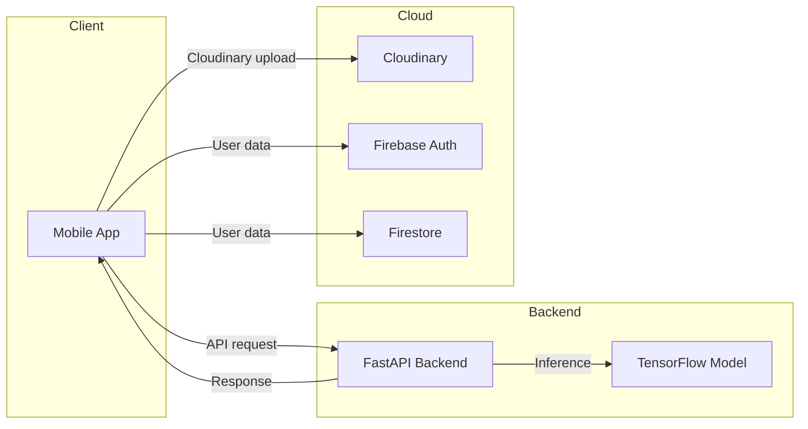

# Food Lens

[](https://flutter.dev)
[](https://firebase.google.com)
[](https://fastapi.tiangolo.com)
[](https://www.tensorflow.org)
[](https://riverpod.dev)

## Project Overview

Food Lens is a production-oriented Flutter mobile app for Vietnamese food recognition, calorie estimation, and nutrition tracking. The solution combines a client-facing mobile experience with a Python FastAPI backend that performs TensorFlow-based inference and supports a Cloudinary image pipeline.

## Resume Highlights

- Developed a Flutter app using Clean Architecture and Riverpod
- Implemented authentication + user data storage with Firebase Auth and Firestore
- Built a FastAPI inference service that consumes image URLs and returns nutrition metadata
- Designed a Cloudinary upload pipeline for mobile image handling
- Localized the app in English and Vietnamese with full theme support
- Applied functional error handling and repository-driven data flow

## Screenshots

> Add screenshots here once available.


## Demo

> Add a demo video or GIF link here once available.

[Demo video placeholder](#)

## Architecture Diagram



## Features

- Food image capture and gallery selection flow
- Cloudinary upload + FastAPI `/analyze` inference pipeline
- Firebase Authentication and Firestore data persistence
- English and Vietnamese app localization
- Light and dark theme support
- Scan history, nutrition summary, and profile management
- Clean Architecture separation: Presentation, Domain, Data
- Meaningful error handling with Failure / Result patterns

## Technology Stack

- Flutter / Dart
- Riverpod
- GoRouter
- Firebase Auth
- Cloud Firestore
- Cloudinary
- FastAPI
- Python
- TensorFlow
- Dio
- flutter_dotenv
- json_serializable

## Key Contributions

- Architected mobile app structure with a layered design for maintainability
- Modeled domain workflows using repository interfaces and use cases
- Integrated cross-platform state management and dependency injection with Riverpod
- Built a backend inference service with FastAPI and TensorFlow compatibility
- Enabled a reliable Cloudinary image pipeline for mobile uploads
- Implemented bilingual UI and consistent theming across app screens

## AI Workflow

1. User captures or selects a food image in the mobile app
2. App uploads the image to Cloudinary and obtains a secure URL
3. App sends the image URL to the FastAPI `/analyze` endpoint
4. Backend fetches the image, performs TensorFlow inference, and classifies the dish
5. Server returns estimated calories, confidence, and nutrition details
6. Mobile app displays results and saves confirmed records to Firestore

## Project Structure

- `lib/` — Flutter application source code
- `lib/core/` — Shared configuration, theme, router, utilities
- `lib/features/` — Feature modules: auth, scan, profile, history, nutrition
- `ai_server/` — FastAPI backend for AI inference
- `test/` — Unit and widget test scaffolding
- `docs/` — Project documentation and architecture notes

## Getting Started

### Prerequisites

- Flutter SDK
- Python 3.11+
- Firebase project credentials
- Cloudinary account

### Run the Flutter app

```bash
flutter pub get
flutter run
```

### Run the AI backend

```bash
cd ai_server
pip install -r requirements.txt
uvicorn main:app --reload --host 0.0.0.0 --port 8000
```

## Current Status

- Mobile app foundation and navigation are implemented
- Firebase and Cloudinary integration are wired
- FastAPI backend is ready for image inference requests
- Localization and theming are in place
- Completion path: finalize scan result persistence, history views, and AI model accuracy

## Future Improvements

- Add robust scan history filtering and analytics
- Improve TensorFlow model accuracy with data augmentation
- Add offline support and caching for scan results
- Deploy backend to cloud infrastructure
- Add automated tests for end-to-end AI workflows
